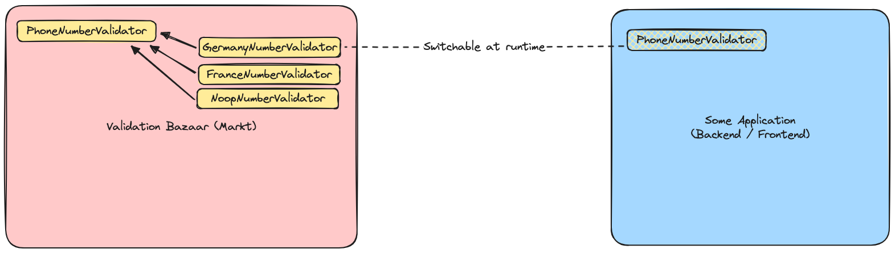

# validation_bazaar

Validation bazaar is a collection of validators. Developers can implement validators in this repository and the users can just decide which validator they want and use it simply.

Strategy Design Pattern is a good motivator for this design.

## Architecture

